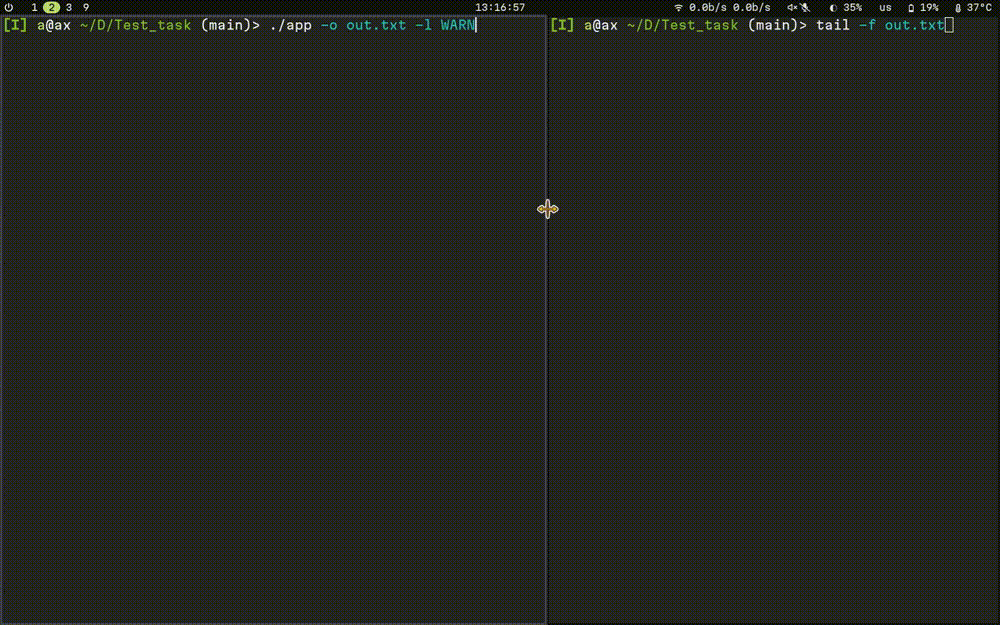

# Многопоточная реализация записи сообщений в журнал

## Описание проекта

Этот репозиторий содержит исходные коды: динамической библиотеки для записи сообщений в файл; приложения, демонстрирующего работу библиотеки; unit-тесты для библиотеки.
Библиотека позволяет фильтровать записываемые сообщения по трём уровням важности: INFO, WARNING, ERROR.
Демонстрационное приложение работает в многопоточном режиме. Оно принимает сообщения от пользователя в одном потоке и записывает их в журнал в другом потоке. 

## Демонстрация работы



## Установка и сборка

Проект создавался для операционых системм Ubuntu/Debian.
Для сборки проекта потребуется установить зависимости: git, make, g++

```bash
sudo apt update && sudo apt install -y git make gcc g++
```

Чтобы установить проект, выполните следующие команды:
```bash
git clone https://github.com/Diukha/Multithreaded-logger.git
cd Multithreaded-logger/
make all
```

Чтобы запустить демонстрационное приложение, выполните:
```bash

```
